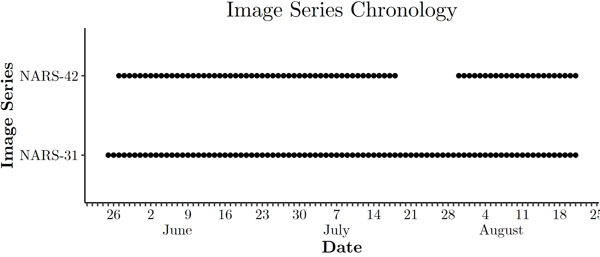

Metadata and Data Preprocessing
================
Author: Asger Svenning 
Date: 2022-09-27 
<h1>
Table of Contents
</h1>

-   <a href="#1-data-file-path-indexing"
    id="toc-1-data-file-path-indexing">1 Data file path indexing</a>
    -   <a href="#11-image-metadata" id="toc-11-image-metadata">1.1 Image
        metadata</a>
-   <a href="#2-metadata-overview" id="toc-2-metadata-overview">2 Metadata
    overview</a>

# 1 Data file path indexing

In order to construct a reproducible, first we must index the metadata
and data filepaths. This can be done using the base *R* functions
`list.dir` and `list.files`.

<table class="table" style="margin-left: auto; margin-right: auto;">
<caption>

Table 1.1: Filetype Counts in the Raw File Index

</caption>
<thead>
<tr>
<th style="empty-cells: hide;border-bottom:hidden;" colspan="1">
</th>
<th style="border-bottom:hidden;padding-bottom:0; padding-left:3px;padding-right:3px;text-align: center; font-weight: bold; " colspan="3">

Subdirectory

</th>
</tr>
<tr>
<th style="text-align:center;font-weight: normal;">

<b>Filetype</b>

</th>
<th style="text-align:center;font-weight: normal;">

NARS-31

</th>
<th style="text-align:center;font-weight: normal;">

NARS-42

</th>
<th style="text-align:center;font-weight: normal;">

Root

</th>
</tr>
</thead>
<tbody>
<tr>
<td style="text-align:center;font-weight: bold;">

csv

</td>
<td style="text-align:center;width: 3cm; ">

0

</td>
<td style="text-align:center;width: 3cm; ">

0

</td>
<td style="text-align:center;width: 3cm; ">

32

</td>
</tr>
<tr>
<td style="text-align:center;font-weight: bold;">

JPG

</td>
<td style="text-align:center;width: 3cm; ">

89

</td>
<td style="text-align:center;width: 3cm; ">

76

</td>
<td style="text-align:center;width: 3cm; ">

0

</td>
</tr>
</tbody>
</table>

## 1.1 Image metadata

Next I will attempt to extract the file metadata using the R package
`exifr` which is a R wrapper around the file metadata software
`exiftools`. Using this tool it is possible to extract the file metadata
tags, particularly of interest here is the “CreateDate” tag, which
contains the date and time of when the photo was taken. Using this it is
possible to obtain the chronology of the image series:

<!-- -->

# 2 Metadata overview

Since I don’t have all the files yet I cannot disaggregate flowering
phenology classes over time, however I can disagreggate over image
series.

