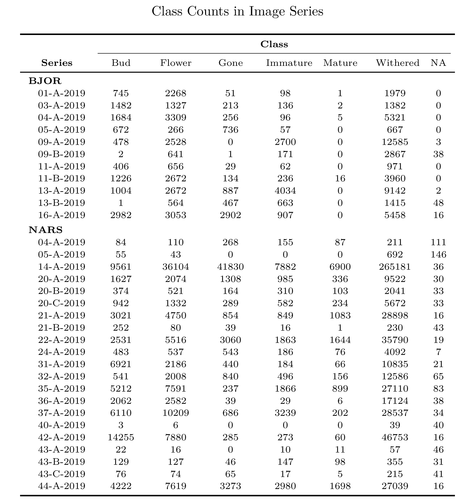

```{r setup, include=FALSE}
knitr::opts_chunk$set(echo = F, eval = F, fig.path = "readme_files/chunk_figures/", base.name = getwd())

library(R.utils)
System$findGhostscript(T,T,T)
library(tidyverse)
library(magrittr)
library(extrafont)
library(forcats)
library(kableExtra)
library(exifr)
library(lubridate)
library(hash)
```

\newpage

# Data file path indexing

In order to construct a reproducible, first we must index the metadata and data filepaths. This can be done using the base *R* functions `list.dir` and `list.files`.

```{r, eval = T}
data_dir <- "../Raw data/Init"

index <- tibble(dir = list.dirs(data_dir)) %>% 
  mutate(file = map(dir, list.files)) %>% 
  unnest(file) %>% 
  filter(str_detect(file,"\\..{1,4}")) %>% 
  mutate(relative = map2_chr(dir,file,~paste0(.x,"/",.y)),
         absolute = R.utils::getAbsolutePath(relative),
         src = str_remove(dir, paste0(data_dir)) %>% 
           str_remove("^/") %>% 
           replace(which(. == ""), "Root"))

index %>% 
  mutate(Filetype = str_extract(file,"(?<=\\.).{1,4}$") %>% 
           factor %>% 
           factor(levels = sort(levels(.)))) %>% 
  filter(Filetype != "db") %>% 
  mutate(Filetype = droplevels(Filetype)) %>% 
  count(src,Filetype) %>%
  complete(src,Filetype,fill=list(n = 0)) %>% 
  # mutate(src = paste0('<p  style="font-weight: normal;">', src, "</p>")) %>% 
  pivot_wider(Filetype,names_from=src,values_from=n) %>% 
  rename("<b>Filetype</b>" = Filetype) %>%
  kable("html",
        align="c", 
        caption = "Filetype Counts in the Raw File Index", 
        escape=F) %>% 
  kable_styling(full_width = T) %>%
  row_spec(0, extra_css = "font-weight: normal;") %>% 
  column_spec(1, bold = T) %>% 
  column_spec(2:4, width = "3cm") %>% 
  add_header_above(c("","Subdirectory" = 3), bold = T)
```

## Image metadata

Next I will attempt to extract the file metadata using the R package `exifr` which is a R wrapper around the file metadata software `exiftools`. Using this tool it is possible to extract the file metadata tags, particularly of interest here is the "CreateDate" tag, which contains the date and time of when the photo was taken. Using this it is possible to obtain the chronology of the image series:

```{r}
library(furrr)

read_exif_long <- function(...) {
  read_exif(...) %>% 
    mutate(across(everything(), as.character)) %>% 
    select(!SourceFile) %>% 
    pivot_longer(everything(),names_to="Tag",values_to="Metadata")
}

plan("multisession")
index_meta <- index %>% 
  select(absolute,src) %>% 
  mutate(fid = row_number(),
         exif = future_map(absolute, read_exif_long, tags = c("FileCreateDate","FileSize", "CreateDate","GPSDateTime"))) %>% 
  unnest(exif)
plan("sequential")

saveRDS(index_meta, "index_meta.rds")
```

```{r, eval=T, fig.height = 3}
index_meta <- readRDS("index_meta.rds")

pretty_month_date <- function(x) {
  day <- mday(x)
  
  month <- snakecase::to_sentence_case(as.character(month(x,T,F,"English_Denmark.1252")))
  
  paste0(ifelse(wday(x) == 1, day, ""), ifelse(day == 7, paste0("\n", month), ""))
}

index_meta %>%
  # select(fid, src,Tag,Metadata) %>%
  filter(Tag != "SourceFile" & str_detect(absolute, "\\.JPG$")) %>%
  pivot_wider(c(fid,src), names_from=Tag, values_from = Metadata) %>%
  mutate(FileSize = as.integer(FileSize)) %>% 
  mutate(Time = ifelse(!is.na(CreateDate), CreateDate, FileCreateDate) %>% 
           ymd_hms %>% 
           as.Date) %>% 
  filter(src != "meta") %>% 
  ggplot(aes(Time,src)) +
  geom_point() +
  scale_x_date(labels = pretty_month_date,
               date_breaks = "1 day") +
  scale_color_brewer(palette = "Set1") +
  labs(x = "Date", y = "Image Series", title = "Image Series Chronology") +
  ggpubr::theme_pubr(base_family = "CMU Serif",
                     margin = F) +
  theme(title = element_text(face = "bold", size = 14),
        plot.title = element_text(face = "plain",
                                  hjust = .5,
                                  size = 18))
```


# Metadata overview
Since I don't have all the files yet I cannot disaggregate flowering phenology classes over time, however I can disagreggate over image series. 


```{r}
index_time <- index_meta %>% 
  transmute(Tag,Metadata,
            file = str_remove(absolute, ".+\\/")) %>% 
  pivot_wider(file,names_from=Tag,values_from=Metadata) %>% 
  transmute(file, Time = ifelse(!is.na(CreateDate), CreateDate, FileCreateDate))

index_time_dict <- hash(index_time$file, index_time$Time)

metadata_agg <- index %>% 
  filter(str_detect(file,"\\.csv$")) %>% 
  mutate(data = map(relative, read_csv, show_col_types = F)) %>% 
  select(file,data) %>%  
  unnest(data) %>% 
  mutate(region_shape = str_extract_all(region_shape_attributes, "[:digit:]+", simplify = T) %>% 
           set_colnames(c("x","y","width","height")) %>% 
           as_tibble,
         class = str_extract_all(region_attributes,"[:alpha:]+", simplify=T)[,2],
         location = str_extract(file, "[:alpha:]+"),
         series = str_extract(file, ".+(?=\\-Annotations\\.csv$)")) %>% 
  select(series, location, filename, region_count, region_shape, class) %>% 
  unnest(region_shape) 
  # mutate(Time = index_time_dict[filename]) # Needs all the files to actually get the time of all images

write_rds(metadata_agg, "metadata_agg.rds", compress = "xz")
```


```{r}
metadata_agg <- read_rds("metadata_agg.rds")

metadata_agg_tidy <- metadata_agg %>% 
  count(series, class) %>% 
  mutate(class = ifelse(class == "", "NA", class)) %>% 
  complete(series, class, fill = list(n = 0)) %>%
  # set_names(c("Image series", "Class", "Count")) %>% 
  pivot_wider(series, names_from = class, values_from = n) %>% 
  select(order(names(.))) %>% 
  relocate(`NA`, .after = last_col()) %>% 
  relocate(series, .before = 1) %>% 
  arrange(str_extract(series, "[:alpha:]+"),
          str_extract(series,"[:digit:]+") %>% as.numeric) 

metadata_agg_tidy %>% 
  mutate(series = str_remove(series,"[:alpha:]+\\-")) %>% 
  rename("\\textbf{Series}" = series) %>% 
  kable("latex",
        booktabs = T,
        align = "c",
        caption = "Class Counts in Image Series",
        escape = F) %>% 
  kable_styling(font_size = 7) %>% 
  column_spec(2, width = "2.25cm") %>%
  column_spec(2:7, width = "1cm") %>%
  pack_rows(index = metadata_agg_tidy %>% 
    transmute(loc = str_extract(series,"[:alpha:]+")) %>% 
    count(loc) %>% 
    summarize(out = n %>% set_names(loc)) %>% 
    pull(out)) %>% 
  add_header_above(c("", "Class" = 7), bold = T) %>% 
  save_kable(file = "readme_files/chunk_figures/metadata_agg.pdf",
             latex_header_includes = "\\usepackage[labelformat=empty]{caption}",
             keep_tex = F)


metadata_table_path <- "readme_files/chunk_figures/metadata_agg.pdf"

system2(
  "gswin64c",
  c( 
    "-sDEVICE=png16m -dTextAlphaBits=4 -r400 -o",
    "readme_files/chunk_figures/metadata_agg.png ",
    metadata_table_path
  ) %>% 
    str_replace_all("\\/","\\\\")
)
```


